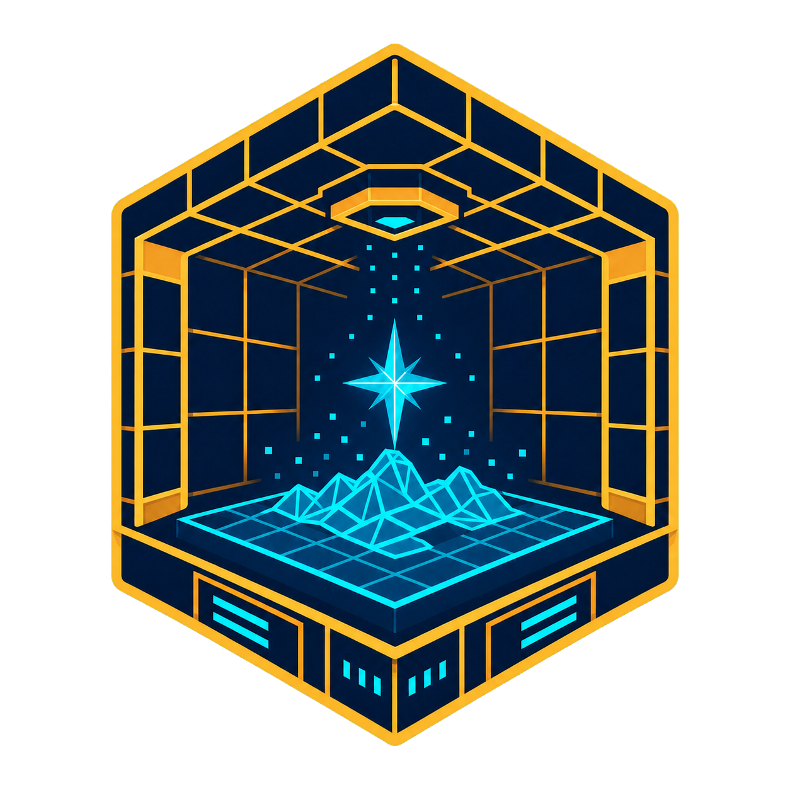

# Holodeck Control for Noctalia

<p align="center">
  
</p>

Thin Luau frontend for the repository's deterministic `holodeckctl`
workflow. The plugin targets Noctalia `v5.0.0-beta.7` and declares plugin API
9, the first API that supports closure callbacks in declarative UI trees.

The panel reads backend status, selects one of the two supported deployment
targets (`home-manager` or `existing-nixos`) and the dark/light appearance mode,
saves those choices to the IR, previews the backend plan, and asks for explicit
confirmation before opening `apply` in a terminal. It also presents GitHub,
GitLab, AWS and Windows VM cards backed by their existing commands.

The UI follows Noctalia's native panel hierarchy: a compact Control Center-style
navigation rail, an overview, a focused system workflow, and an integration
picker with one provider detail at a time. It uses semantic control sizes,
palette roles supported by the pinned shell, tooltip-labelled icon actions, and
an explicit destructive variant for stopping the Windows VM. The original
holographic-chamber artwork under `assets/` is shared by the launcher, README
and panel header; a reduced companion mark keeps the same identity legible in
the compact navigation rail. The bar uses Noctalia's native `cube-spark` glyph
with the semantic `on_surface` color so it tracks both light and dark themes.

## Security boundary

The Luau code never writes the IR and never evaluates backend-provided `argv`.
Every process is selected from a static allowlist. During packaging, Nix
replaces `@holodeckctl@` with the immutable store path of the repository's
backend wrapper; the suffixes below remain literals:

```text
holodeckctl --json status
holodeckctl --json init
holodeckctl --json set deployment.target home-manager
holodeckctl --json set deployment.target existing-nixos
holodeckctl --json set appearance.theme.mode dark
holodeckctl --json set appearance.theme.mode light
holodeckctl --json set integrations.windows.rdp.displayMode half
holodeckctl --json set integrations.windows.rdp.displayMode fullscreen
holodeckctl --json plan
holodeckctl apply
holodeckctl action holodeck-setup
holodeckctl action holodeck-doctor
holodeckctl action github-setup
holodeckctl action gitlab-setup
holodeckctl action aws-configure
holodeckctl action aws-login
holodeckctl action aws-identity
holodeckctl action windows-up
holodeckctl action windows-status
holodeckctl action windows-rdp
holodeckctl action windows-web
holodeckctl action windows-logs
holodeckctl action windows-down
```

The non-JSON `apply` and interactive `action` commands run in a terminal so
output, authentication, choices and any privilege prompt remain visible. The
RDP and Web actions are graphical launchers and run detached from the panel,
without opening a disposable terminal. Status only returns provider/profile
metadata; it excludes emails, key paths and secrets.

The source tree intentionally retains the replacement token, so it can be
linted directly but must be installed through the Nix package before it can run.

## Entry points

- Widget: `holodeck/control:config`
- Panel: `holodeck/control:control`

Open the panel directly with:

```console
noctalia msg panel-toggle holodeck/control:control
```

Validate the manifest/backend-setting contract offline with:

```console
noctalia plugins lint plugins/noctalia/holodeck-control
```
